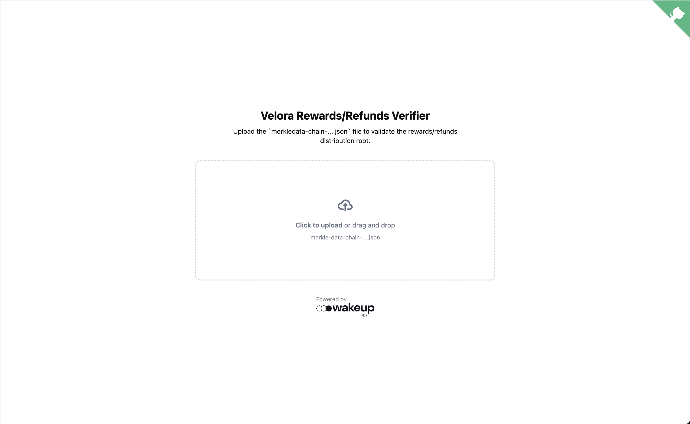
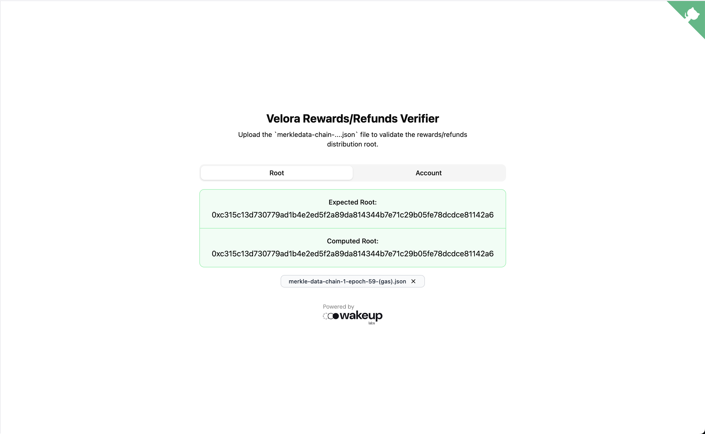
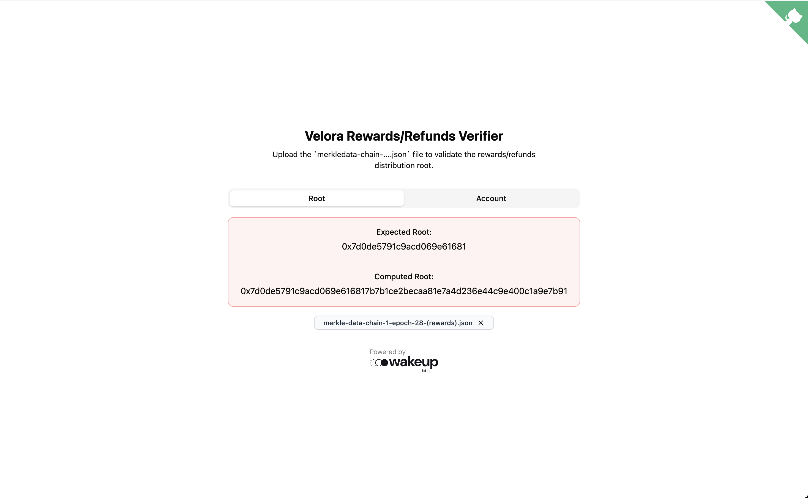
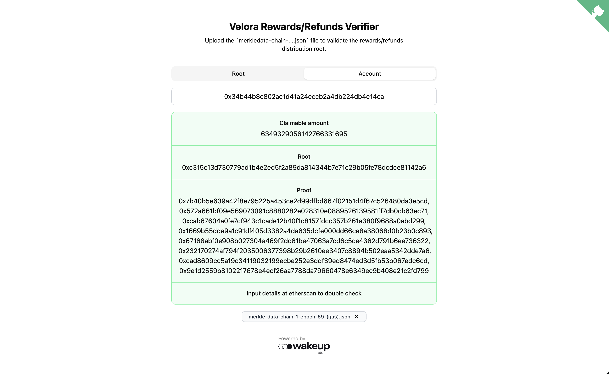
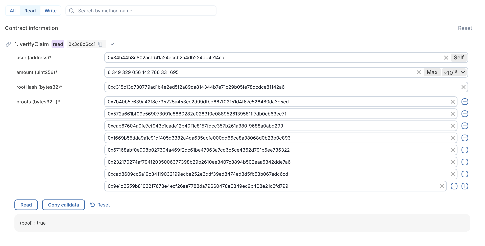

# Velora Distribution Verifier

Velora Distribution Verifier helps users to validate the merkle roots proposed for the rewards and refunds distributions.

## Overview

Paraswap aka Velora is a staking platform for DeFi protocols. It allows users to stake their PSP (Paraswap Protocol Share) tokens and earn rewards in the form of PSP and ETH. 

There are two ways to stake PSP: sePSP1 and sePSP2.

- sePSP1: Stake PSP in the Basic Pool (Stake only PSP)
- sePSP2: Stake PSP in the Boosted Pool (Stake PSP + ETH) 

And there are two types of rewards: rewards and refunds.

- Rewards: Are a distribution of Velora DAO profit for the epoch. In particular 80% of the fees collected in the epoch are distributed for users and 20% for the protocol. 
- Refunds: Are a reimbursement of a percentage of the gas used to execute the transactions in the epoch.

Upon each distribution a merkle root is proposed and if approved later submitted to the smart contract that allows users to claim their rewards and refunds. The merkle root is the product of a merkle tree built from the list of users and amounts to be distributed. If the merkle root doesn't match the data shared for the distribution, funds may be lost, or simply redirected to the wrong user. 

This tool helps users to validate the merkle root proposed for the rewards and refunds distributions. Given the json outputs from the Velora Distribution Tool, it builds the merkle tree from the ground up and allows for a quick check.

## Usage

### Root verification 

In a first instance we recompute the whole tree from the provided file and compare it with the root proposed. 

First load the json file you can find in the Velora distribution proposal.

Right away you'll see a green background if the computed root matches the proposed root, or a red background if they don't match.

### User claim verification

You can also verify your claim is included in the root through the etherscan explorer. We've deployed a view contract that allows you to assert your claim onchain.

You can start from the raw file itself, find your address and input details manually or help yourself with the UI to do so. 

Once you have the details, you can input them in the UI, after clicking the `Read` button you should see a `true` as a result if your claim is included in the root. Contract is deployed at `0xEca298c34670898F5E06c2856658e096675099E3` and verified at https://eth-sepolia.blockscout.com/address/0xEca298c34670898F5E06c2856658e096675099E3?tab=contract

